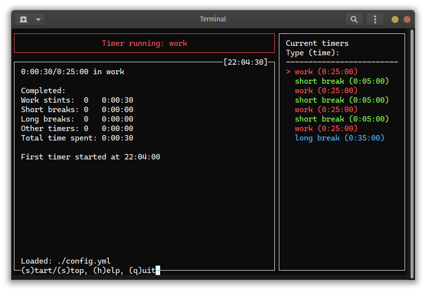

# potato-timer
A simple Pomodoro-style timer with intuitive CLI, written in Python. Developed and tested
in Pop!_OS Linux and occasionally tested in Windows 10.



## Downloading the timer
Easiest way to get the program is to download one of the 
[stand-alone executable binaries (for Linux or Windows)](https://github.com/mtijas/potato-timer/releases) 
and associated config.yml file. More info on configuration [down below](#configuration). 

## Running from source

### Getting the source code files
Clone this repository to the folder of your choice:
```
git clone https://github.com/mtijas/potato-timer.git
```

### Dependencies
Potato Timer uses python to run so it should obviously be installed.
Minimum required version of python is 3.8.

PyYAML package is used to read settings files. Install the package with pip:
```
pip install pyyaml
```

Appdirs is used to help find the preferred config location. Install with pip:
```
pip install appdirs
```

Curses is used to draw the user interface. In Linux it might already be installed 
but in Windows you should install the `windows-curses` PyPI package:
```
pip install windows-curses
```

### Starting the program
Since there is no compiled binaries available the program should be started with python:
```
python src/PotatoTimer.py
```

## Configuration
Timers can be configured using YAML. The configuration file is searched from the current
folder of the timer. The default config file is named config.yml. User may also provide 
their own configuration file with the command line option `-c 'path/to/config.yml'`.

Config will be automatically searched from:
- config file provided via command line option
- `$XDG_CONFIG_HOME/potato-timer/config.yml`
- `~/.config/potato-timer/config.yml`
- `~/.potato-timer-config.yml`
- `./config.yml`

More on [$XDG_CONFIG_HOME](https://specifications.freedesktop.org/basedir-spec/basedir-spec-latest.html).

### Timers
Timers are configured as a list of type-duration pairs, where type is basically 
the name of the timer and duration is given in minutes. Built-in types of timers 
are `work`, `short break` and `long break`, though you may call your timers whatever 
you like `i.e. coffee break`.

A single work timer would be configured as follows:
```yaml
timers:
  - type: "work"
    duration: 25
```

Decimals are also accepted for duration (i.e. `duration: 0.1` is a timer lasting 6 seconds).
More examples of timer configurations can be found 
[in the example configuration file](#example-configuration-file).

### Alarm type
Alarm type can be either `beep` or `flash`. 

- `beep` rings the terminal bell
- `flash` flashes the terminal window.

The default when setting omitted from the file is `beep`.

Example: `alarm_type: "beep"`

### Alarm repeat
Number of times alarm will sound/flash each time alarm triggers.

Example: `alarm_repeat: 3`

### Use of colors
When `use_colors` is se to `True` the program will be beautifully decorated with 
meaningful colors for different types of timers:

- `work` is red
- `short break` is green
- `long break` is blue
- Any other type of timer will be yellow. 

Set this `False` and the program will be plain black and white. The default is `True`.

### Example configuration file

```yaml
alarm_type: "beep"
alarm_repeat: 3
use_colors: True
timers:
  - type: "work"
    duration: 25
  - type: "short break"
    duration: 5
  - type: "work"
    duration: 25
  - type: "short break"
    duration: 5
  - type: "work"
    duration: 25
  - type: "short break"
    duration: 5
  - type: "work"
    duration: 25
  - type: "long break"
    duration: 35

```